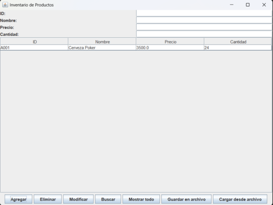

# 🛒 Aplicación de Inventario de Productos en Java



Esta es una aplicación de escritorio desarrollada en **Java Swing** para gestionar un inventario de productos de una tienda. La aplicación permite **agregar, eliminar, modificar, buscar y mostrar productos**, así como **guardar y cargar** los datos desde un archivo de texto.

## 📌 Características

- Interfaz gráfica intuitiva creada con Java Swing.
- Estructura de datos basada en `ArrayList` (colección dinámica).
- Soporte para operaciones CRUD (Crear, Leer, Actualizar, Eliminar).
- Uso de clases genéricas para flexibilidad y reutilización.
- Almacenamiento y recuperación de datos desde archivo `.txt`.

## 🧰 Tecnologías utilizadas

- Java 17+
- Swing (interfaz gráfica)
- ArrayList (colección de productos)
- Manejo de archivos (`FileReader`, `FileWriter`)

## 🗂️ Estructura del Proyecto

📁 src/ ┣ 📄 Producto.java ┣ 📄 Inventario.java ┗ 📄 VentanaInventario.java 📄 inventario.txt 📄 screenshot.png 📄 README.md


## ▶️ Cómo ejecutar

1. Clona el repositorio:
   ```bash
   git clone https://github.com/sebastian2003111/Aplicaci-n-de-Inventario-de-Productos.git

2. Abre el proyecto en tu IDE Java (NetBeans, VS Code, IntelliJ).

3. Ejecuta VentanaInventario.java.

4. Usa la interfaz para agregar, modificar o eliminar productos.


## 📚 Explicación técnica

Esta aplicación utiliza un ArrayList<Producto> para almacenar los productos. Gracias a esto, es posible recorrer y manipular fácilmente los elementos agregados. Se utilizan genéricos para mantener la flexibilidad del inventario y se aplica el principio de separación entre lógica de negocio y presentación.


🧠 Autor
Desarrollado por **Sebastian Bohorquez** como actividad académica.
